# Architecture — RAG Pipeline (Day 08 Lab)

> Template: Điền vào các mục này khi hoàn thành từng sprint.
> Deliverable của Documentation Owner.

## 1. Tổng quan kiến trúc

```
[Raw Docs]
    ↓
[index.py: Preprocess → Chunk → Embed → Store]
    ↓
[ChromaDB Vector Store]
    ↓
[rag_answer.py: Query → Retrieve → Rerank → Generate]
    ↓
[Grounded Answer + Citation]
```

**Mô tả ngắn gọn:**
> TODO: Mô tả hệ thống trong 2-3 câu. Nhóm xây gì? Cho ai dùng? Giải quyết vấn đề gì?
Nhóm đang xây một hệ thống RAG hỏi-đáp nội bộ: lấy tài liệu chính sách/quy trình (HR, IT, CS...), chia chunk, nhúng vào ChromaDB, rồi truy xuất ngữ cảnh để LLM trả lời kèm citation nguồn.nHệ thống này hướng tới nhân viên hoặc bộ phận vận hành nội bộ cần tra cứu nhanh các quy định như hoàn tiền, SLA, quyền truy cập, nghỉ phép. Vấn đề được giải quyết là giảm thời gian tìm tài liệu rời rạc và hạn chế trả lời sai/bịa bằng cách buộc câu trả lời bám sát nội dung đã index.
---

## 2. Indexing Pipeline (Sprint 1)

### Tài liệu được index
| File | Nguồn | Department | Số chunk |
|------|-------|-----------|---------|
| `policy_refund_v4.txt` | policy/refund-v4.pdf | CS | 6 |
| `sla_p1_2026.txt` | support/sla-p1-2026.pdf | IT | 5 |
| `access_control_sop.txt` | it/access-control-sop.md | IT Security | 7 |
| `it_helpdesk_faq.txt` | support/helpdesk-faq.md | IT | 6 |
| `hr_leave_policy.txt` | hr/leave-policy-2026.pdf | HR | 5 |

### Quyết định chunking
| Tham số | Giá trị | Lý do |
|---------|---------|-------|
| Chunk size | 1600 characters (tương đương 400 tokens) | Đủ lớn để giữ trọn ngữ cảnh của một điều khoản/quy trình (policy, SOP), giảm trường hợp mất ý khi câu trả lời cần nhiều câu liên tiếp. |
| Overlap | 320 characters (tương đương 80 tokens) | Giữ liên kết ngữ nghĩa giữa 2 chunk liền kề, hạn chế mất thông tin tại ranh giới chunk và cải thiện recall cho truy vấn nằm giữa 2 đoạn. |
| Chunking strategy | Heading-based / paragraph-based | Tách theo heading trước để bảo toàn cấu trúc tài liệu; với phần không có heading rõ ràng thì tách theo paragraph để chunk vẫn tự nhiên, dễ trích dẫn và grounded hơn. |
| Metadata fields | source, section, effective_date, department, access | Phục vụ filter, freshness, citation |

### Embedding model
- **Model**: text-embedding-3-small
- **Vector store**: ChromaDB (PersistentClient)
- **Similarity metric**: Cosine

---

## 3. Retrieval Pipeline (Sprint 2 + 3)

### Baseline (Sprint 2)
| Tham số | Giá trị |
|---------|---------|
| Strategy | Dense (embedding similarity) |
| Top-k search | 10 |
| Top-k select | 3 |
| Rerank | Không |

### Variant (Sprint 3)
| Tham số | Giá trị | Thay đổi so với baseline |
|---------|---------|------------------------|
| Strategy | `retrieval_mode="dense"` + `use_rerank=True` | Giữ nguyên retrieve, thêm bước lọc lại |
| Top-k search | 10 | Không đổi |
| Top-k select | 3 | Không đổi |
| Rerank | `cross-encoder/ms-marco-MiniLM-L-6-v2` | Mới (chấm điểm lại relevance) |
| Query transform | Không dùng (`query_transform=None`) | Không đổi |

**Lý do chọn variant này:**
> TODO: Giải thích tại sao chọn biến này để tune.
> Ví dụ: "Chọn hybrid vì corpus có cả câu tự nhiên (policy) lẫn mã lỗi và tên chuyên ngành (SLA ticket P1, ERR-403)."
Baseline dense thường trả về một số chunk “gần nghĩa” nhưng chưa thật sự bám sát câu hỏi, làm context đưa vào prompt còn nhiễu.  
Nhóm chọn thêm rerank để giữ nguyên chi phí retrieve (top-k search = 10) nhưng ưu tiên lại các chunk liên quan nhất trước khi generate (top-k select = 3).  
Cách này tuân theo A/B rule (chỉ đổi 1 biến: `use_rerank`) nên dễ đo tác động rõ ràng so với baseline.
---

## 4. Generation (Sprint 2)

### Grounded Prompt Template
```
Answer only from the retrieved context below.
If the context is insufficient, say you do not know.
Cite the source field when possible.
Keep your answer short, clear, and factual.

Question: {query}

Context:
[1] {source} | {section} | score={score}
{chunk_text}

[2] ...

Answer:
```

### LLM Configuration
| Tham số | Giá trị |
|---------|---------|
| Model | TODO (gpt-4o-mini / gemini-1.5-flash) |
| Temperature | 0 (để output ổn định cho eval) |
| Max tokens | 512 |

---

## 5. Failure Mode Checklist

> Dùng khi debug — kiểm tra lần lượt: index → retrieval → generation

| Failure Mode | Triệu chứng | Cách kiểm tra |
|-------------|-------------|---------------|
| Index lỗi | Retrieve về docs cũ / sai version | `inspect_metadata_coverage()` trong index.py |
| Chunking tệ | Chunk cắt giữa điều khoản | `list_chunks()` và đọc text preview |
| Retrieval lỗi | Không tìm được expected source | `score_context_recall()` trong eval.py |
| Generation lỗi | Answer không grounded / bịa | `score_faithfulness()` trong eval.py |
| Token overload | Context quá dài → lost in the middle | Kiểm tra độ dài context_block |

---

## 6. Diagram (tùy chọn)

> TODO: Vẽ sơ đồ pipeline nếu có thời gian. Có thể dùng Mermaid hoặc drawio.

```mermaid
graph LR
    A[User Query] --> B{Query Transform?}
    B -->|No| C[Single Query]
    B -->|Yes| D[Expanded Queries]
    D --> E[Merge & Deduplicate]

    C --> F{Retrieval Mode}
    E --> F

    F -->|dense| G1[Dense Retrieve]
    F -->|sparse| G2[Sparse Retrieve]
    F -->|hybrid| G3[Hybrid Retrieve]

    G1 --> H[Top-k Search Candidates]
    G2 --> H
    G3 --> H

    H --> I{Use Rerank?}
    I -->|Yes| J[Cross-Encoder Rerank]
    I -->|No| K[Top-k Select]

    J --> K
    K --> L[Build Context Block]
    L --> M[Build Grounded Prompt]
    M --> N{LLM Provider}
    N -->|openai| O1[gpt-4o-mini]
    N -->|gemini| O2[gemini-1.5-flash]

    O1 --> P[Answer]
    O2 --> P
    P --> Q[Sources + Chunks Used + Config]

```


